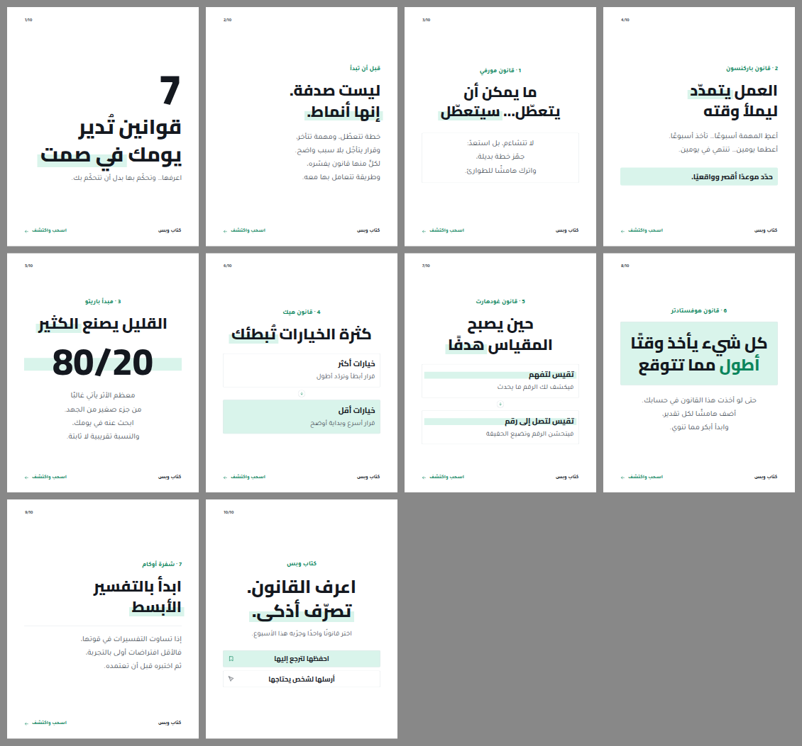
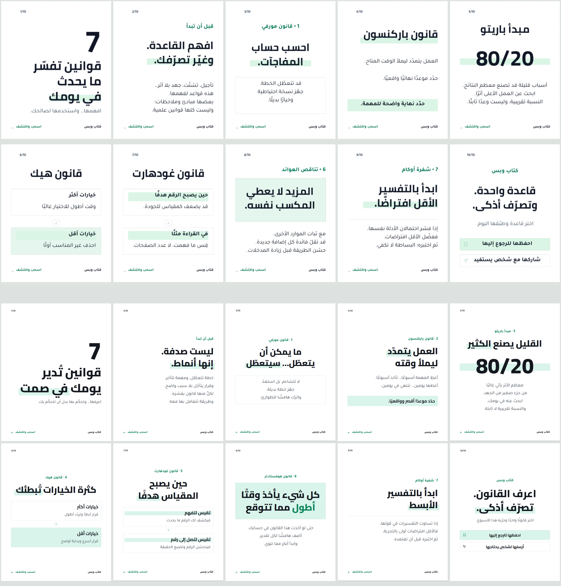

# مثال: «أشهر 7 قوانين في العالم» بالأسلوب التعليمي النعناعي

كاروسيل من 10 شرائح بمقاس 1080×1350 لحساب «كتاب وبس»، بُني من فكرة الموضوع وحدها بطريقة مهارة
`carousel-director`، ثم صُمّم بأوامر `studio` نفسها في مخزن جديد بأسلوب `mint-highlight`: أبيض،
عناوين سوداء عريضة، تظليل نعناعي خلف الكلمة المهمة، إطارات رفيعة، مسار بسهم نازل، وخاتمة بصفّي إجراء.



الملف الكامل للموضوع بأقسامه الثلاثة عشر (التحليل، العناوين الثلاثة والاختيار، النصوص، الـStoryboard،
وصف كل شريحة، الألوان، الخطوط، النسخة الجاهزة، برومبت لكل شريحة مع البرومبت السلبي، موجز المصمم،
المعاينة الوصفية): [`brief.md`](brief.md).

## مقارنة بالمرجع

في الأعلى الصورة المرجعية التي أرسلتها (`reference.webp`)، وفي الأسفل ما بناه الاستوديو بنص جديد:



ما أُخذ من المرجع: الأبيض، العنوان الأسود العريض، التظليل في النصف السفلي من الكلمة، الإطار الرفيع،
اللوح المظلّل، شريط الخلاصة، المربعان والسهم النازل، صفّا الإجراء، والعدّاد واسم الحساب ودعوة السحب
نصوصًا صغيرة. ما لم يؤخذ: نصوص المرجع؛ كُتب النص من جديد (وصيغ القوانين كما قالها أصحابها).

## الحالة في كل مرحلة

| المرحلة | الحالة | الدليل |
|---|---|---|
| planned → composed | تم محليًا | `spec.json` ← `studio compose` ← `design.json` (12ms داخل العملية، 142ms عبر سطر الأوامر) |
| locally_verified | تم محليًا | `check.json`: 0 أخطاء و0 تحذيرات؛ `renders/render.json`: لا فيض في المتصفح ولا كلمة أخيرة منفردة في العناوين |
| ملف PPTX | تم محليًا | `renders/laws-carousel.pptx`: 68 نصًا أصليًا من اليمين لليسار و28 شكلًا؛ قراءة النصوص من الملف تطابق الوثيقة حرفًا بحرف |
| البرومبتات | تم محليًا | `prompts.md` من `studio prompts design.json`: Storyboard، النسخة الجاهزة، برومبت لكل شريحة مع السلبي |
| Canva | لم يُشغَّل | لم يُنقل شيء إلى Canva؛ يُنقل بعد اعتمادك المعاينة (`canva-arabic`) |

حدود معروفة: في PowerPoint يُكتب التظليل بتظليل النص، فيغطي السطر كله لا نصفه السفلي (مسجّل في
`limitations` داخل التقرير). وموصل Canva لا يلوّن كلمة داخل نص ولا يظلّلها: تبقى الكلمة بلون النص.

## الأحجام

داخل نطاقات الطلب: عنوان الغلاف 116 بكسل (والرقم 240)، العناوين 88، النص 44، التمهيد 36، العدّاد
والتذييل 26–28. الأسلوب لا يكبّر الصفحة القصيرة فوق هذه الأحجام بل يترك الفراغ.

## تعديل بالمحادثة (`edits.json`)

«كبّر العنوان الثاني قليلًا» على نسخة: عنوان الشريحة 2 من 88 إلى 97 بكسل، والتمهيد والسطور تحرّكا
12 بكسل، والشرائح التسع الأخرى لم تتغيّر عنصرًا عنصرًا؛ 0 أخطاء بعده. لم يُطبَّق على الملف المسلَّم
لأن 97 فوق نطاق العناوين في الطلب.

## نسخة بالأزرق الأساسي

`spec-blue.json` هو الطلب نفسه مع `"accentRole": "accent"`: التمهيد والأسهم بأزرق الهوية والتظليل خليط
منه. 0 أخطاء و0 تحذيرات: `renders/contact-blue.png`.

## إعادة البناء

```sh
export BASEERA_HOME=$(mktemp -d)
node scripts/studio-cli.js init
node scripts/studio-cli.js brand preset kitabwbs
node scripts/studio-cli.js compose docs/examples/laws-carousel/spec.json --out design.json
node scripts/studio-cli.js check design.json
node scripts/studio-cli.js prompts design.json --out prompts.md
node scripts/render-design.mjs design.json renders --pptx laws-carousel.pptx
node scripts/studio-cli.js edit design.json "كبّر العنوان الثاني قليلًا"   # التعديل التجريبي
```

المعاينات وملف PPTX و`prompts.md` مشتقات تُعاد من `design.json`؛ الوثيقة هي المصدر. والصفحات نفسها
هي كاروسيل القبول الثاني للأسلوب في `docs/library` (`mint-highlight.laws-carousel.png`).
