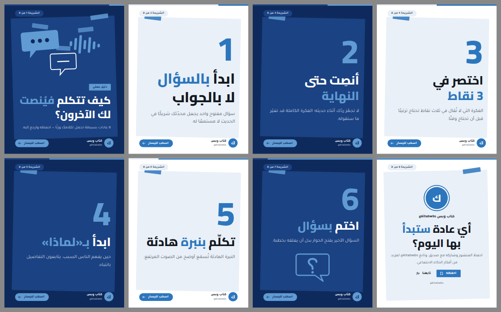

# مثال القبول: «كيف تتكلم فينصت لك الآخرون؟»

كاروسيل من 8 شرائح بمقاس 1080×1350 لحساب «كتاب وبس»: غلاف، ست عادات، ختام. الأسلوب
`collage-cutout` (كولاج تحريري) بتناوب داكن/فاتح يبدأ بالغلاف الداكن. بُني بأوامر `studio`
نفسها في مخزن جديد، لا بنص اختبار.



## الحالة في كل مرحلة

| المرحلة | الحالة | الدليل |
|---|---|---|
| planned → composed | تم محليًا | `spec.json` ← `studio compose` ← `design.json` (17ms داخل العملية، 150ms عبر سطر الأوامر) |
| locally_verified | تم محليًا | `check.json`: 0 أخطاء، تحذير واحد (تطويل في نص المصدر «بـ«لماذا»»)؛ `renders/render.json`: لا فيض في المتصفح ولا كلمة أخيرة منفردة في العناوين |
| ملف PPTX | تم محليًا | `renders/listen-carousel.pptx`: 64 نصًا أصليًا من اليمين لليسار، 74 شكلًا، 4 رسوم متجهة قابلة للتعديل؛ قراءة النصوص من الملف تطابق الوثيقة حرفًا بحرف |
| transfer_pending (Canva) | **بانتظار موافقتك** | `canva/plan.json` (27 خطوة) جاهز ولم يُنفَّذ: قاعدتك ألا يُحفظ شيء في Canva قبل اعتماد المعاينة |
| canva_draft / canva_verified / saved / exported_verified | لم يُشغَّل | — |

حدود مسار الموصل المسجّلة في الخطة: لا يختار الخط (تظهر النصوص بخط Canva الافتراضي حتى تغيّره)،
ولا يلوّن كلمة داخل نص (تفقد الكلمات المميزة لونها). مسار PPTX يحفظ الخطين والكلمات الملوّنة، لكن
الاستيراد في Canva من موصل Claude يحتاج رابطًا عامًا للملف، ولا يوجد رابط عام هنا ولم أنشر الملف.

## التعديلان (`edits.json`)

| الأمر | ما تغيّر | ما لم يتغيّر |
|---|---|---|
| «كبّر العنوان الثاني» | عنوان الشريحة 2 من 109 إلى 129 بكسل، وأُعيد توزيع رقمها وسطرها الداعم | الشرائح السبع الأخرى عنصرًا عنصرًا |
| «غيّر الجرافيك الرابع» | رسم الشريحة 7 فقط (الرابع بترتيب القراءة: ثلاثة في الغلاف ثم هذا) بفقاعة فيها «؟» عربية رسمتُها (`art/question.svg`) | النصوص، ورسوم الغلاف الثلاثة |

أصلحتُ في الطريق خمسة أخطاء ظهرت في هذا الاختبار، مذكورة في `edits.json`؛ أهمها أن «العنوان
الثاني» كان يكبّر عنوان الغلاف.

## المعاينة على الهاتف

`renders/phone-1.png` و`phone-2.png` و`phone-8.png`: الصفحة بعرض 390 نقطة كما تُرى على الهاتف. النص
الداعم أصغر ما في الصفحة ويبقى مقروءًا.

## إعادة البناء

```sh
export BASEERA_HOME=$(mktemp -d)
node scripts/studio-cli.js init
node scripts/studio-cli.js brand preset kitabwbs
for k in bubble wave quiet; do node scripts/studio-cli.js asset add docs/examples/listen-carousel/art/$k.svg --kind generated; done
node scripts/studio-cli.js compose docs/examples/listen-carousel/spec.json --out design.json
node scripts/studio-cli.js edit design.json "كبّر العنوان الثاني"
node scripts/studio-cli.js asset add docs/examples/listen-carousel/art/question.svg --kind generated
node scripts/studio-cli.js edit design.json "غيّر الجرافيك الرابع a_4c180577448ea435"
node scripts/render-design.mjs design.json renders --pptx listen-carousel.pptx
```

المعاينات وملف PPTX مشتقات تُعاد من `design.json`؛ الوثيقة هي المصدر.

## النسخ الاحتياطي والاستعادة

`studio backup` ثم `studio restore` في مخزن فارغ أعادا التصميم بأسلوبه وأوضاع صفحاته الثمانية
ونصوصه وتعديليه، والأصول الأربعة بتحقق البصمة، والهوية، وسجل المراجعات كاملًا.

## ما بقي ظاهرًا

- تحذير التطويل في «بـ«لماذا»» من نص المصدر؛ لم أغيّر النص.
- الأرقام في `metrics.json` مقاسة هنا؛ التوكنات والتكلفة `null` لأن المزوّد لا يتيح قياسهما لهذا المسار.
